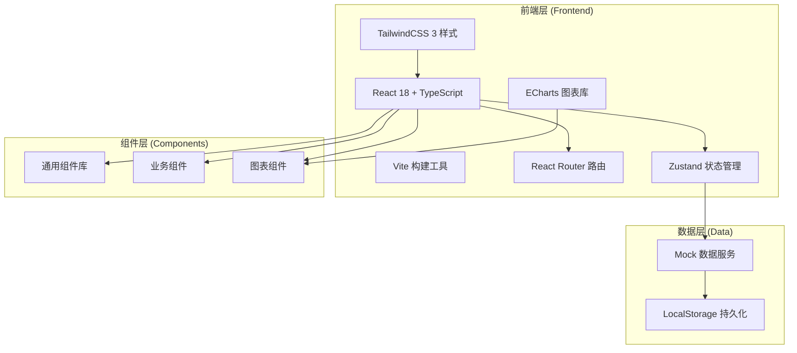
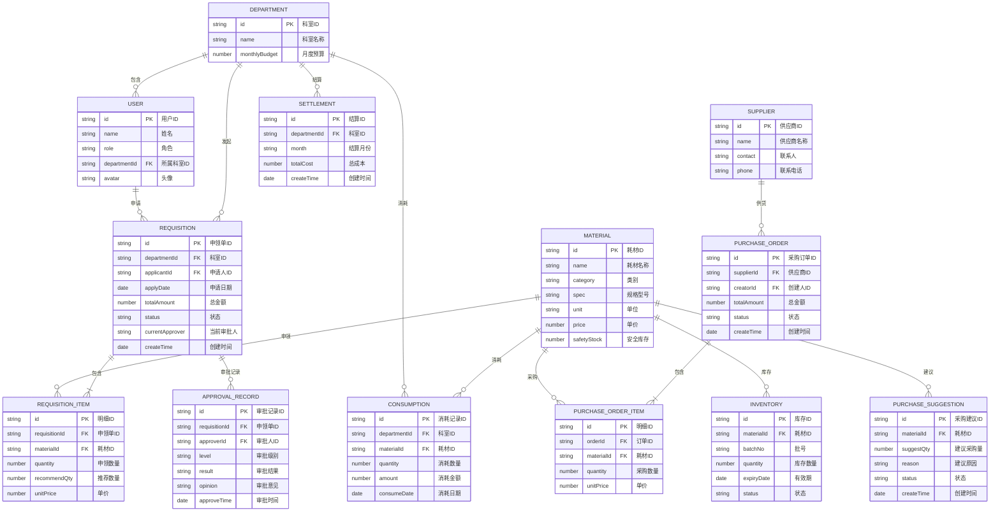

## 1. 架构设计



---

## 2. 技术说明

- **前端框架**：React@18 + TypeScript@5，采用函数组件 + Hooks 开发模式
- **构建工具**：Vite@5，提供快速的开发体验和优化的生产构建
- **样式方案**：TailwindCSS@3，原子化 CSS，配合自定义主题配置
- **图表库**：ECharts@5，专业数据可视化，支持大屏展示
- **路由管理**：React Router@6，嵌套路由，支持权限控制
- **状态管理**：Zustand@4，轻量级状态管理，支持持久化
- **数据方案**：本地 Mock 数据服务，模拟后端 API，数据持久化到 LocalStorage
- **UI 图标**：Lucide React，现代线性图标库

---

## 3. 路由定义

| 路由路径 | 页面名称 | 权限角色 | 说明 |
|----------|----------|----------|------|
| `/dashboard` | 首页大屏 | 全部角色 | 数据可视化大屏 |
| `/requisition` | 科室申领 | 护士站、科室主任 | 申领列表与新建申领 |
| `/requisition/approval` | 审批中心 | 科室主任、设备科、院长 | 待审批申领单 |
| `/inventory` | 库存总览 | 设备科、院长 | 全院库存查看 |
| `/inventory/warning` | 库存预警 | 设备科、院长 | 库存低于安全线列表 |
| `/inventory/expiry` | 效期管理 | 设备科、院长 | 近效期与过期耗材 |
| `/purchase/suggestion` | 采购建议 | 设备科 | 系统自动生成的采购建议 |
| `/purchase/approval` | 采购审批 | 设备科、院长 | 采购订单审批 |
| `/purchase/order` | 订单管理 | 设备科 | 采购订单全生命周期 |
| `/settlement/cost` | 成本分摊 | 科室主任、设备科、院长 | 月度成本分摊明细 |
| `/settlement/report` | 结算报表 | 科室主任、设备科、院长 | 月度结算报表与导出 |
| `/settlement/detail` | 采购明细 | 设备科、院长 | 采购订单明细查询 |
| `/system/user` | 权限管理 | 院长 | 用户角色分配 |
| `/system/config` | 阈值配置 | 院长 | 审批阈值、安全库存等配置 |
| `/system/basic` | 基础数据 | 设备科、院长 | 耗材、科室、供应商管理 |

---

## 4. 数据模型

### 4.1 数据模型定义 (ER图)



### 4.2 核心数据类型定义 (TypeScript)

```typescript
// 用户角色
type UserRole = 'nurse' | 'director' | 'equipment' | 'admin';

// 申领单状态
type RequisitionStatus = 'draft' | 'pending' | 'approved' | 'rejected' | 'completed';

// 采购订单状态
type PurchaseOrderStatus = 'pending' | 'approved' | 'ordered' | 'received' | 'completed';

// 库存状态
type InventoryStatus = 'normal' | 'warning' | 'near_expiry' | 'expired' | 'locked';

// 用户
interface User {
  id: string;
  name: string;
  role: UserRole;
  departmentId: string;
  avatar?: string;
}

// 科室
interface Department {
  id: string;
  name: string;
  monthlyBudget: number;
}

// 耗材
interface Material {
  id: string;
  name: string;
  category: string;
  spec: string;
  unit: string;
  price: number;
  safetyStock: number;
}

// 库存
interface Inventory {
  id: string;
  materialId: string;
  materialName: string;
  batchNo: string;
  quantity: number;
  expiryDate: string;
  status: InventoryStatus;
  daysToExpiry?: number;
}

// 申领单
interface Requisition {
  id: string;
  departmentId: string;
  departmentName: string;
  applicantId: string;
  applicantName: string;
  applyDate: string;
  totalAmount: number;
  status: RequisitionStatus;
  currentApprover: string;
  items: RequisitionItem[];
  createTime: string;
}

interface RequisitionItem {
  id: string;
  materialId: string;
  materialName: string;
  spec: string;
  unit: string;
  quantity: number;
  recommendQty: number;
  unitPrice: number;
  subtotal: number;
}

// 采购建议
interface PurchaseSuggestion {
  id: string;
  materialId: string;
  materialName: string;
  category: string;
  currentStock: number;
  safetyStock: number;
  suggestQty: number;
  reason: string;
  status: 'pending' | 'processed' | 'ignored';
  createTime: string;
}

// 采购订单
interface PurchaseOrder {
  id: string;
  supplierId: string;
  supplierName: string;
  creatorId: string;
  creatorName: string;
  totalAmount: number;
  status: PurchaseOrderStatus;
  items: PurchaseOrderItem[];
  createTime: string;
}

interface PurchaseOrderItem {
  id: string;
  materialId: string;
  materialName: string;
  quantity: number;
  unitPrice: number;
  subtotal: number;
}

// 消耗记录
interface Consumption {
  id: string;
  departmentId: string;
  departmentName: string;
  materialId: string;
  materialName: string;
  category: string;
  quantity: number;
  amount: number;
  consumeDate: string;
}

// 结算
interface Settlement {
  id: string;
  departmentId: string;
  departmentName: string;
  month: string;
  totalCost: number;
  budget: number;
  usedBudget: number;
  remainingBudget: number;
  items: Consumption[];
}

// 大屏统计数据
interface DashboardStats {
  totalInventoryValue: number;
  monthlyConsumption: number;
  monthlyPurchase: number;
  nearExpiryCount: number;
  consumptionTrend: { date: string; amount: number; department: string }[];
  turnoverRate: { department: string; rate: number }[];
  nearExpiryRatio: { category: string; ratio: number; count: number }[];
  purchaseProgress: { status: string; count: number; percentage: number }[];
}

// 系统配置
interface SystemConfig {
  approvalThreshold: number;
  nearExpiryDays: number;
  approvalTimeoutHours: number;
}
```

---

## 5. 目录结构

```
src/
├── components/          # 通用组件
│   ├── layout/         # 布局组件（侧边栏、顶部栏）
│   ├── ui/             # 基础UI组件（按钮、卡片、表格等）
│   └── charts/         # 图表组件
├── pages/              # 页面组件
│   ├── dashboard/      # 首页大屏
│   ├── requisition/    # 科室申领
│   ├── inventory/      # 库存管理
│   ├── purchase/       # 采购管理
│   ├── settlement/     # 消耗结算
│   └── system/         # 系统管理
├── store/              # 状态管理
│   ├── userStore.ts
│   ├── requisitionStore.ts
│   ├── inventoryStore.ts
│   ├── purchaseStore.ts
│   └── configStore.ts
├── mock/               # Mock数据服务
│   ├── data/           # Mock数据源
│   └── services/       # Mock API服务
├── types/              # TypeScript类型定义
│   └── index.ts
├── utils/              # 工具函数
│   ├── date.ts
│   ├── format.ts
│   └── permission.ts
├── hooks/              # 自定义Hooks
│   ├── useCountdown.ts
│   └── usePermission.ts
├── router/             # 路由配置
│   └── index.tsx
├── styles/             # 全局样式
│   └── globals.css
├── App.tsx
└── main.tsx
```

---
