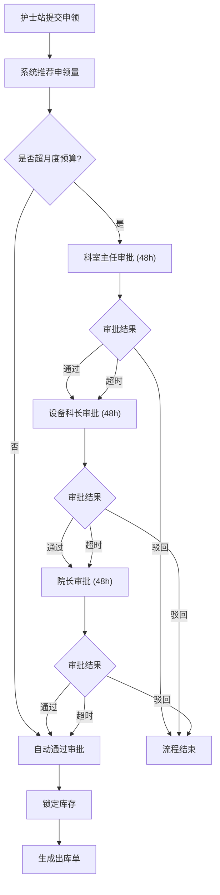
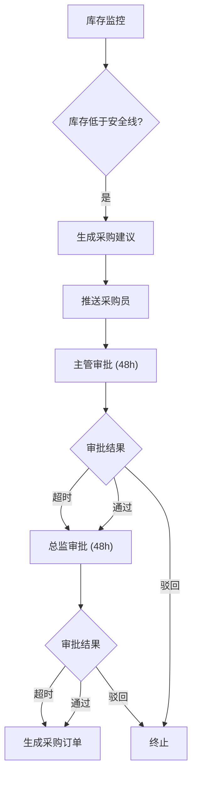
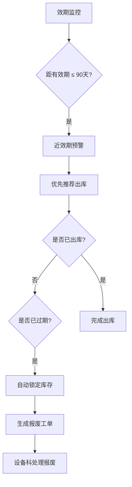

## 1. 产品概述

医用耗材智慧管理平台，整合科室申领、库存预警、采购补货与消耗结算全链路，实现医用耗材从采购到使用的全流程数字化管理。通过智能推荐、自动化审批、实时预警和数据可视化，提升耗材管理效率，降低运营成本，保障医疗安全。

- 解决医用耗材管理中申领不规范、库存积压、近效期浪费、审批流程繁琐、成本核算不清等痛点
- 目标用户：护士站、科室主任、设备科、采购员、院长等医院各级管理人员

---

## 2. 核心功能

### 2.1 用户角色

| 角色 | 核心权限 |
|------|----------|
| 护士站 | 查看本科室数据，提交耗材申领 |
| 科室主任 | 查看本科室预算执行，审批本科室申领单 |
| 设备科 | 查看全院库存，管理采购订单，处理预警 |
| 院长 | 全局管理，调整审批阈值，查看全平台数据 |

### 2.2 功能模块

1. **首页大屏**：实时数据看板，展示各科室耗材消耗趋势、库存周转率、近效期占比和采购执行进度
2. **科室申领**：在线提交申领，智能推荐申领量，超预算触发三级审批
3. **库存管理**：库存预警、近效期预警、过期锁定、出入库管理
4. **采购管理**：自动生成采购建议，采购审批，订单管理
5. **消耗结算**：成本分摊，结算报表，月度分析报表导出
6. **系统管理**：权限管理，审批阈值配置，耗材基础数据维护

### 2.3 页面详情

| 页面名称 | 模块名称 | 功能描述 |
|----------|----------|----------|
| 首页大屏 | 数据概览卡片 | 展示总库存价值、当月消耗、采购金额、近效期数量等关键指标 |
| 首页大屏 | 消耗趋势图 | 按时间维度展示各科室耗材消耗趋势，支持筛选切换 |
| 首页大屏 | 库存周转率 | 展示各科室库存周转情况，环形图或柱状图 |
| 首页大屏 | 近效期占比 | 按耗材类别展示近效期耗材占比 |
| 首页大屏 | 采购执行进度 | 展示采购订单状态分布，实时进度 |
| 首页大屏 | 筛选工具栏 | 按科室、耗材类别、日期范围筛选数据 |
| 科室申领 | 申领列表 | 展示本科室申领单，按状态分类查看 |
| 科室申领 | 新建申领 | 选择耗材，系统自动推荐申领量，显示预算占用 |
| 科室申领 | 审批中心 | 待审批列表，审批操作（通过/驳回），显示审批限时倒计时 |
| 库存管理 | 库存总览 | 全院库存列表，支持按科室、类别、效期筛选 |
| 库存管理 | 库存预警 | 低于安全线耗材列表，红色高亮预警 |
| 库存管理 | 效期管理 | 近效期（90天内）和过期耗材列表，优先出库建议 |
| 采购管理 | 采购建议 | 系统自动生成的采购建议列表，支持批量生成订单 |
| 采购管理 | 采购审批 | 采购订单审批流程，超时自动升级提醒 |
| 采购管理 | 订单管理 | 采购订单全生命周期管理 |
| 消耗结算 | 成本分摊 | 月度消耗自动分摊至各科室成本中心 |
| 消耗结算 | 结算报表 | 月度结算报表，支持一键导出Excel |
| 消耗结算 | 采购明细 | 采购订单明细查询与导出 |
| 系统管理 | 权限管理 | 用户角色分配，四级权限控制 |
| 系统管理 | 阈值配置 | 审批金额阈值、安全库存线、近效期天数等参数配置 |
| 系统管理 | 基础数据 | 耗材档案、科室信息、供应商管理 |

---

## 3. 核心流程

### 3.1 科室申领审批流程

护士站提交申领单，系统根据历史用量和库存自动推荐申领量。若申领金额未超出科室月度预算，则自动通过并锁定库存生成出库单；若超出预算，则触发三级审批流程（科室主任→设备科长→院长），每级审批限时48小时，超时自动越级流转至下一级。

### 3.2 库存预警与采购流程

系统实时监控库存水平，当库存低于安全线时自动生成采购建议并推送至采购员。采购建议经主管和总监两级审批后生成采购订单，超48小时未处理自动升级提醒。

### 3.3 效期管理与报废流程

系统提前90天对近效期耗材发出智能预警，在出库时优先推荐近效期耗材。耗材过期后自动锁定库存并生成报废工单。

---

## 4. 用户界面设计

### 4.1 设计风格

- **主色调**：医疗蓝 (#1E6FD9) 作为主色，搭配深科技蓝 (#0D2137) 作为深色背景，形成专业医疗科技感
- **辅助色**：预警橙 (#FF9500)、危险红 (#FF3B30)、成功绿 (#34C759) 用于状态标识
- **按钮风格**：圆角按钮 (8px)，主按钮使用渐变蓝，次按钮使用描边样式
- **字体**：标题使用思源黑体 Bold，正文使用思源黑体 Regular，数字使用等宽字体
- **布局风格**：顶部导航 + 左侧菜单 + 内容区的经典后台布局，大屏页采用全屏卡片式布局
- **图标风格**：线性图标，统一 2px 描边，圆角端点

### 4.2 页面设计概览

| 页面名称 | 模块名称 | UI 元素 |
|----------|----------|---------|
| 首页大屏 | 数据概览卡片 | 深色渐变背景，毛玻璃卡片，数字跳动动画，5秒刷新提示 |
| 首页大屏 | 趋势图表 | 平滑曲线，渐变填充，悬停显示详情 |
| 首页大屏 | 状态指示 | 彩色圆点状态标签，进度条带动画 |
| 科室申领 | 申领表单 | 自动填充推荐量，预算占用实时计算，超预算红色警告 |
| 科室申领 | 审批列表 | 倒计时徽章，紧急标识，审批操作按钮组 |
| 库存管理 | 预警列表 | 红/橙/黄三色预警等级，效期倒计时 |
| 消耗结算 | 报表页面 | 表格斑马纹，合计行固定，导出按钮 |

### 4.3 响应式设计

桌面端优先设计，最低支持 1366×768 分辨率。关键数据大屏支持 1920×1080 及以上分辨率全屏展示。表格和列表在较窄屏幕下支持横向滚动。

---
